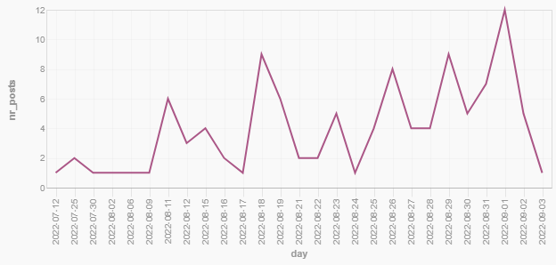
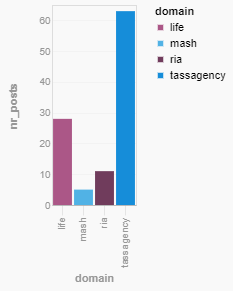
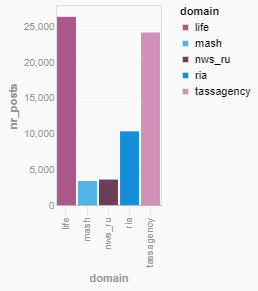

# Documenting Russian Coverage of the ZNPP

The ZNPP is the [largest nuclear power plant in Europe, powering 4 million homes and providing a 5th of all of Ukraine’s energy](https://www.theguardian.com/world/2022/mar/04/zaporizhzhia-nuclear-power-plant-everything-you-need-to-know). Located in the south east of Ukraine, along the left bank of the Dnieper river . Russian media reported they took control of the plant on the 28th of February, but in reality, it was held by Ukrainian civilians until the 4th of March. [A video of the siege](https://www.youtube.com/watch?v=fYUT36YGOh8), originating from Ukrainian sources at the plant, has been viewed online more than 4 million times.

Nothing was posted on VK about the ZNPP until the 12th of June, where TASS suggested in one of their daily updates that Ukraine was shelling the plant. [By looking at the actual text](https://spevktator.io/vk?sql=select+domain%2C+date_utc%2C+text+from+posts+where+text+like+%27%25%D0%97%D0%90%D0%AD%D0%A1%25%27+order+by+date_utc), we can see the content of these posts are largely TASS’ daily updates. The graph below, shows a recent increase in posts, many of which aren’t daily updates. [They peaked on the 1st of September](https://spevktator.io/vk?sql=select%0D%0A++date%28date_utc%29+as+day%2C%0D%0A++count%28text%29+as+nr_posts%0D%0Afrom%0D%0A++posts%0D%0Awhere+text+like+%27%25%D0%97%D0%90%D0%AD%D0%A1%25%27%0D%0Agroup+by%0D%0A++day%0D%0Ahaving+day+%3E%3D+%272022-01-01%27%0D%0Aorder+by%0D%0A++day#g.mark=line&g.x_column=day&g.x_type=ordinal&g.y_column=nr_posts&g.y_type=quantitative), likely due to the arrival of IAEA inspectors, which Russian propagandists have used to characterise Ukrainian soldiers as aggressors, attacking the facility, which, in turn, builds on pre-established domestic propaganda narratives. Depending on the results of the IAEA investigation, we could see a further increase in posts (should it support Russian narratives), or a stark decrease in posts (should it counter them).

Figure 1: Note that this version of the graph may not be entirely representative due to being taken only part way through the 3rd of September, a more up to date version can be found: [here](https://spevktator.io/vk?sql=select%0D%0A++date%28date_utc%29+as+day%2C%0D%0A++count%28text%29+as+nr_posts%0D%0Afrom%0D%0A++posts%0D%0Awhere+text+like+%27%25%D0%97%D0%90%D0%AD%D0%A1%25%27%0D%0Agroup+by%0D%0A++day%0D%0Ahaving+day+%3E%3D+%272022-01-01%27%0D%0Aorder+by%0D%0A++day#g.mark=line&g.x_column=day&g.x_type=ordinal&g.y_column=nr_posts&g.y_type=quantitative)

It’s interesting to note the quantity of content being produced by outlets in relation to each other. Both of the top two channels are state controlled, but unlike TASS, Life isn’t overtly owned by the government, rather controlled through subsidiaries. As such, TASS could be considered more ‘trustworthy’ by the domestic population, due to its supposed proximity to the government and subject matter experts, hence why Russia are using it as their primary avenue for news about the ZNPP.

Figure 2: [Chart showing content output that included the ZNPP](https://spevktator.io/vk?sql=select+domain%2C+count%28*%29+as+nr_posts+from+posts+where+%22text%22+like+%3Ap0+group+by+domain+order+by+nr_posts+desc&p0=%25%D0%97%D0%90%D0%AD%D0%A1%25#g.mark=bar&g.x_column=domain&g.x_type=ordinal&g.y_column=nr_posts&g.y_type=quantitative&g.color_column=domain). Figure 3: [Chart showing total content output](https://spevktator.io/vk?sql=select+domain%2C+count%28*%29+as+nr_posts+from+posts+group+by+domain+order+by+nr_posts+desc#g.mark=bar&g.x_column=domain&g.x_type=ordinal&g.y_column=nr_posts&g.y_type=quantitative&g.color_column=domain)

